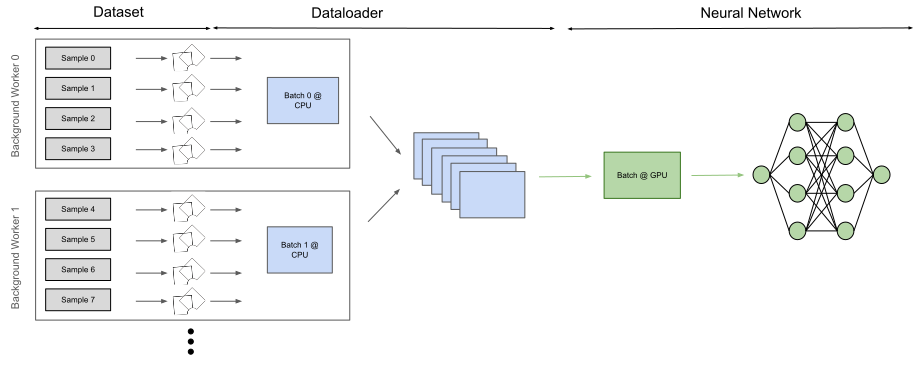
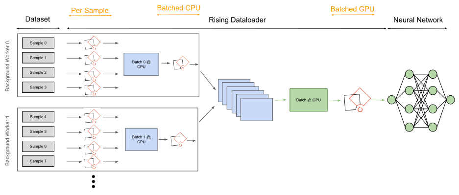

<div align="center">


[](https://codecov.io/gh/PhoenixDL/rising)

[](https://join.slack.com/t/phoenixdl/shared_invite/enQtODgwODI0MTE1MjgzLTJkZDE4N2NhM2VmNzVhYTEyMzI3NzFmMDY0NjM3MzJlZWRmMTk5ZWM1YzY2YjY5ZGQ1NWI1YmJmOTdiYTdhYTE)
[](https://rising.readthedocs.io/en/latest/?badge=latest)
[](https://results.pre-commit.ci/latest/github/PhoenixDL/rising/master)

</div>

| Python Version                                                    | Platform                                             | Unittests                                                                                         |
| ----------------------------------------------------------------- | ---------------------------------------------------- | ------------------------------------------------------------------------------------------------- |
|  |    |      |
|  |  |  |
|  |    |      |

## What is `rising`?

Rising is a high-performance data loading and augmentation library for 2D *and* 3D data completely written in PyTorch.
Our goal is to provide a seamless integration into the PyTorch Ecosystem without sacrificing usability or features.
Multiple examples for different use cases can be found in our [tutorial docs](https://rising.readthedocs.io/en/latest/tutorials.html) e.g.
[2D Classification on MedNIST](https://github.com/PhoenixDL/rising/blob/master/notebooks/classification_2d_mednist.ipynb),
[3D Segmentation of Hippocampus (Medical Decathlon)](https://github.com/PhoenixDL/rising/blob/master/notebooks/lightning_segmentation.ipynb),
[Example Transformation Output](https://rising.readthedocs.io/en/latest/transformations.html),
[Integration of External Frameworks](https://rising.readthedocs.io/en/latest/external_augmentation.html)

## Why another framework?

|            | rising  |   TorchIO    | Batchgenerators | Kornia  | DALI | Vanilla PyTorch | Albumentations |
| :--------: | :-----: | :----------: | :-------------: | :-----: | :--: | :-------------: | :------------: |
| Volumetric |    ✅    |      ✅       |        ✅        |    ❌    |  ❌   |        ❌        |       ❌        |
| Gradients  |    ✅    |      ❌       |        ❌        |    ✅    |  ❌   |        ❌        |       ❌        |
|    GPU     |    ✅    |      ❌       |        ❌        |    ✅    |  ✅   |        ❌        |       ❌        |
|  Backend   | PyTorch | PyTorch/SITK |      NumPy      | PyTorch | C++  |     PyTorch     |     NumPy      |

## Docs

[master](https://rising.readthedocs.io/en/latest/)

## Installation

Pypi Installation

```bash
pip install rising
```

Editable Installation for development

```bash
git clone git@github.com:PhoenixDL/rising.git
cd rising
pip install -e .
```

Running tests inside rising directory (top directory not the package directory)

```bash
python -m unittest
```

Check out our [contributing guide](https://rising.readthedocs.io/en/latest/contributing.html) for more information or additional help.

## What can I do with `rising`?

Rising currently consists out of two main modules:

### `rising.loading`

The `Dataloader` of rising will be your new best friend because it handles all your transformations and applies them efficiently to the data either on CPU or GPU.
On CPU you can easily switch between transformations which can only be performed per sample and transformations which can be applied per batch.
In contrast to the native PyTorch datasets you don't need to integrate your augmentation into your dataset.
Hence, the only purpose of the dataset is to provide an interface to access individual data samples.
Our `DataLoader` is a direct subclass of the PyTorch's dataloader and handles the batch assembly and applies the augmentations/transformations to the data.

### `rising.transforms`

This module implements many transformations which can be used during training for preprocessing and augmentation.
All of them are implemented directly in PyTorch such that gradients can be propagated through the transformations and (optionally) it can be applied on the GPU.
Finally, all transforms are implemented for 2D (natural images) and 3D (volumetric) data.

In the future, support for keypoints and other geometric primitives which can be assembled by connected points will be added.

## `rising` MNIST Example with CPU and GPU augmentation

`rising` uses the same `Dataset` structure as PyTorch and thus we can just reuse the MNIST dataset from torchvision.

```python3
import torchvision
from torchvision.transforms import ToTensor

# define dataset and use to tensor trafo to convert PIL image to tensor
dataset = torchvision.datasets.MNIST('./', train=True, download=True,
                                     transform=ToTensor())
```

In the next step, the transformations/augmentations need to be defined.
The first transforms converts the Sequence from the torchvision dataset into a dict for the following `rising` transform which work on dicts.
At the end, the transforms are compose to one callable transform which can be passed to the `Dataloader`.

```python3
import rising.transforms as rtr
from rising.loading import DataLoader, default_transform_call
from rising.random import DiscreteParameter, UniformParameter

# define transformations
transforms = [
    rtr.SeqToMap("data", "label"),  # most rising transforms work on dicts
    rtr.NormZeroMeanUnitStd(keys=["data"]),
    rtr.Rot90((0, 1), keys=["data"], p=0.5),
    rtr.Mirror(dims=DiscreteParameter([0, 1]), keys=["data"]),
    rtr.Rotate(UniformParameter(0, 180), degree=True),
]

# by default rising assumes dicts but torchvision outputs tuples
# so we need to modify `transform_call` to support sequences and dicts
composed = rtr.Compose(transforms, transform_call=default_transform_call)
```

The `Dataloader` from `rising` automatically applies the specified transformations to the batches inside the multiprocessing context of the CPU.

```python3
dataloader = DataLoader(
    dataset, batch_size=8, num_workers=8, batch_transforms=composed)
```

Alternatively, the augmentations can easily be applied on the GPU as well.

```python3
dataloader = DataLoader(
    dataset, batch_size=8, num_workers=8, gpu_transforms=composed)
```

If either the GPU or CPU is the bottleneck of the pipeline, the `Dataloader` can be used to balance the augmentations load between them.

```python3
transforms_cpu = rtr.Compose(transforms[:2])
transforms_gpu = rtr.Compose(transforms[2:])

dataloader = DataLoader(
    dataset, batch_size=8, num_workers=8,
    batch_transforms=transforms_cpu,
    gpu_transforms=transforms_gpu,
)
```

More details about how and where the augmentations are applied can be found below.
You can also check out our example Notebooks for [2D Classification](https://github.com/PhoenixDL/rising/blob/master/notebooks/classification_2d_mednist.ipynb), [3D Segmentation](https://github.com/PhoenixDL/rising/blob/master/notebooks/lightning_segmentation.ipynb)
and [Transformation Examples](https://rising.readthedocs.io/en/latest/transformations.html).

## Dataloading with `rising`

In general you do not need to be familiar with the whole augmentation process which runs in the background but if you are still curious about the
detailed pipeline this section will give a very short introduction into the backend of the `Dataloader`.
The flow charts below highlight the differences between a conventional augmentation pipeline and the pipeline used in `rising`.
CPU operations are visualized in blue while GPU operations are green.

The flow chart below visualizes the default augmentation pipeline of many other frameworks.
The transformations are applied to individual samples which are loaded and augmented inside of multiple background workers from the CPU.
This approach is already efficient and might only be slightly slower than batched execution of the transformations (if applied on the CPU).
GPU augmentations can be used to perform many operations in parallel and profit heavily from vectorization.


`rising` lets the user decide from case to case where augmentations should be applied during this pipeline.
This can heavily dependent on the specific tasks and the underlying hardware.
Running augmentations on the GPU is only efficient if they can be executed in a batched fashion to maximize the parallelization GPUs can provide.
As a consequence, `rising` implements all its transformations in a batched fashion and the `Dataloader` can execute them efficiently on the CPU and GPU.
Optionally, the `Dataloader` can still be used to apply transformations on a per sample fashion, e.g. when transforms from other frameworks should be integrated.


Because the `rising` augmentation pipeline is a superset of the currently used methods, external frameworks can be integrated into `rising`.

## Project Organization

`Issues`: If you find any bugs, want some additional features or maybe just have a question don't hesitate to open an issue :)

`General Project Future`: Most of the features and the milestone organisation can be found inside the `projects` tab.
Features which are planned for the next release/milestone are listed under `TODO Next Release` while features which are not scheduled yet are under `Todo`.

`Slack`: Join our Slack for the most up to date news or just to have a chat with us :)
