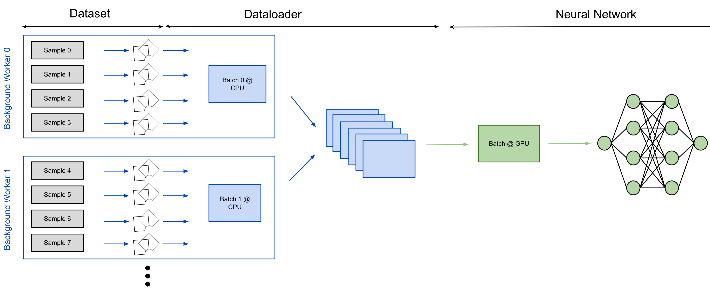
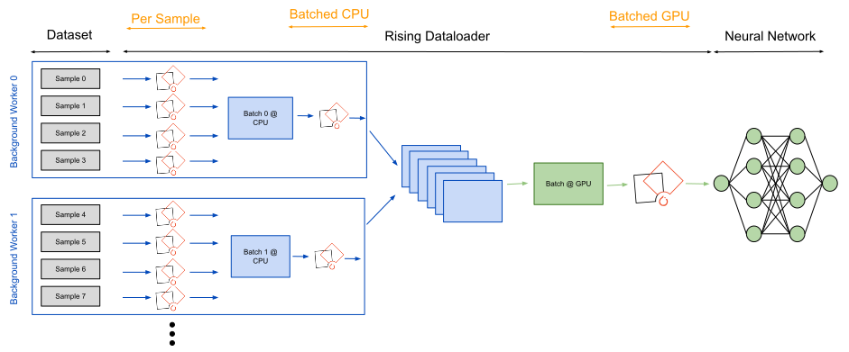

### :warning: Current release disclaimer :warning:
This is an alpha release which is highly experimental. All transforms should be stable and tested but there might be some bugs.

<div align="center">


[](https://codecov.io/gh/PhoenixDL/rising)

[](https://join.slack.com/t/phoenixdl/shared_invite/enQtODgwODI0MTE1MjgzLTJkZDE4N2NhM2VmNzVhYTEyMzI3NzFmMDY0NjM3MzJlZWRmMTk5ZWM1YzY2YjY5ZGQ1NWI1YmJmOTdiYTdhYTE)
[](https://rising.readthedocs.io/en/latest/?badge=latest)

| Python Version                                                 | Platform                                             | Unittests                                                                                         | NotebookTests                                                                            |
|----------------------------------------------------------------|------------------------------------------------------|---------------------------------------------------------------------------------------------------|------------------------------------------------------------------------------------------|
|  |    |      |  |
|  |  |  |  |
|  |    |     |  |

</div>


## What is `rising`?
Rising is a high-performance data loading and augmentation library for 2D *and* 3D data completely written in PyTorch.
Our goal is to provide a seamless integration into the PyTorch Ecosystem without sacrificing usability or features.

## Why another framework?
|            | `rising` | TorchIO       | Batchgenerators | Kornia | DALI    | Vanilla PyTorch | Albumentations | 
|------------|----------|---------------|-----------------|--------|---------|-----------------|----------------|
| Volumetric | ✅       | ✅            | ✅             | ❌      | ❌     | ❌              | ❌             |
| Gradients  | ✅       | ❌            | ❌             | ✅      | ❌     | ❌              | ❌             |
| GPU        | ✅       | ❌            | ❌             | ✅      | ✅     | ❌              | ❌             |
| Backend    | PyTorch  | PyTorch/SITK  | Numpy          | PyTorch | C++     | PyTorch         | Numpy          |  


## Installation
Pypi Installation
```bash
pip install rising
```

Editable Installation for development

```bash
git clone git@github.com:PhoenixDL/rising.git
cd rising
pip install -e .
```

Running tests inside rising directory (top directory not the package directory)
```bash
python -m unittest
```


## What can I do with `rising`?
Rising currently consists out of two main modules:

### `rising.loading`
Provides classes which can be used to load your data.
We provide some baseclasses like the `Cachedataset` or `Lazydataset` which can be easily used to load data either from the RAM or hard drive.
In contrast to the native PyTorch datasets you don't need to integrate your augmentation into your dataset. Hence, the only perpose of the dataset is to provide an interface to access individual data samples.
Our `DataLoader` is a direct subclass of the PyTorch dataloader and handles the batch assembly and applies the augmentation transformations to whole batches at once.
Additionally, there is a container class which can be used to hold multiple datasets at once and thus provides a interface for the entirety of your data (e.g. train/val split or kfold).

### `rising.transforms`
This module implements many augmentation transformations which can be used during training.
All of them are implemented directly in PyTorch such that gradients can be propagated through them or augmentations could be computed live on the GPU.
Finally, all transforms are implemented for 2D and 3D data.

In the future, support for keypoints and bounding boxes will be added (bounding boxes are suported with an inefficient workaround with segmentations).

## `rising` MNIST Example with CPU and GPU augmentation
`rising` uses the same `Dataset` structure as PyTorch and thus we can just reuse the MNIST dataset from torchvision.
```python3
import torchvision
import rising.transforms as rtr
from rising.loading import DataLoader

# define dataset
dataset = torchvision.datasets.MNIST('./', train=True, download=True)
```

In the next step, the transformations/augmentations need to be defined.
The first transforms converts the Sequence from the torchvision dataset into a dict for the following `rising` transform which work on dicts.
At the end, the transforms are compose to one callable transform which can be passed to the `Dataloader`. 

```python3
# define transformations
transforms = [
    rtr.SeqToMap("data", "label"), # rising uses dicts
    rtr.ZeroMeanUnitVarianceTransform(),
    rtr.Rot90((0, 1), keys="data"),
    rtr.Mirror(dims=(0, 1), keys="data"),
]

composed = rtr.Compose(transforms)
```

The `Dataloader` from `rising` automatically applies the specified transformations to the batches inside the multiprocessing context of the CPU.
```python3
dataloader = DataLoader(
    dataset, batch_size=8, batch_transforms=composed, num_workers=8)
```

Alternatively, the augmentations can easily be applied on the GPU as well.
```python3
dataloader = DataLoader(
    dataset, batch_size=8, gpu_transforms=composed, num_workers=8)
```

If either the GPU or CPU is the bottleneck of the pipeline, the `Dataloader` can be used to balance the augmentations load between them.
```python3
transforms_cpu = rtr.Compose(transforms[:2])
transforms_gpu = rtr.Compose(transforms[2:])

dataloader = DataLoader(
    dataset, batch_size=8, num_workers=8,
    batch_transforms=transforms_cpu,
    gpu_transforms=transforms_gpu,
)
```

A much more detailed overview how and where the augmentations are applied can be found below.
You can also check out our example Notebooks for [2D classification](), [3D segmentation]()
and [transformation examples](https://rising.readthedocs.io/en/latest/transformations.html).

## Dataloading with `rising`
In general you do not need to familiar with the whole augmentation process which runs in the background but if you are still curious about the
detailed pipeline this section will give a very short introduction into the backend of the dataloader.
The flow charts below highlight the differences between conventional augmentation pipelines and the pipeline used in `rising`.
CPU operations are visualized in blue while GPU operations are green.

The flow chart below visualizes the default augmentation pipeline of many other frameworks.
The transforms are applied to individual samples which are loaded and augmented inside background workers from the CPU.
This approach is very efficient and might only be slightly slower than batched execution of the transformations if applied on the CPU.
GPU can be used to perform many operations in parallel and profit heavily from vectorization.
Thus all transformations which should be able to be executed on the GPU should work in a batched fashion.


`rising` lets the user decide from case to case where augmentations should be applied during this pipeline.
This can be heavily dependent on the specific tasks and the underlying hardware.
As a consequence, rising implements all its transformations in a batched fashion and the dataloader can execute them efficiently on the CPU and GPU.
Optionally, the `Dataloader` can still be used to apply transformations on a per sample fashion, e.g. when transforms from other frameworks should be integrated.


Because the `rising` augmentation pipeline is a superset of the currently used methods external frameworks can be integrated into rising.
Check out our [External Augmentation Notebooks](https://rising.readthedocs.io/en/latest/external_augmentation.html) for more information (including `Batchgenerators`, `TorchIO`, `Albumentations`).

## Project Organization
`Issues`: If you find any bugs, want some additional features or maybe just a question don't hesitate to open an issue :)

`General Project Future`: Most of the features and the milestone organisation can be found inside the `projects` tab.
Features which are planned for the next release/milestone are listed unter `TODO Next Release` while features which are not scheduled yet are under `Todo`.

`Slack`: Join our Slack for the most up to date news about rising or just to have a chat with us :) 
